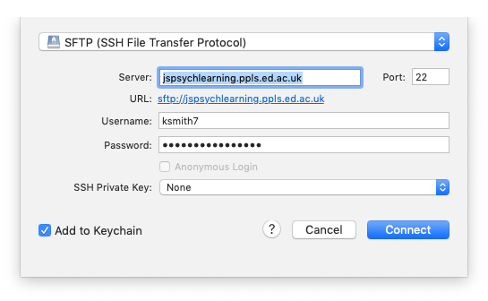

## The plan for week 1 practical

For the practical component of weeks 1 and 2 the plan is to introduce enough of the basics of jsPsych and javascript so we can jump in to building simple experiments in week 3. In week 1 we'll focus on the very basics of webpages and jsPsych, get you set up on our teaching server, and show you how to upload code there. Remember, the idea is that you can work through these practicals in the lab classes and, if necessary, in your own time (e.g. if you want to make a start before the lab class, or if you don't complete the practical in the lab class) - the lab class provides dedicated time each week to focus on doing the practicals with on-tap support from the teaching team, but you may need more than the 2 hours to get these practicals done. We are happy to help with the previous week's class if you tried to finish it off in your own time and need some help.

## Practical tasks for this week

- Work through sections 01, 02 and 03 of [Online Experiments with jsPsych tutorial](https://softdev.ppls.ed.ac.uk/online_experiments/index.html).

Once you have done these tasks you should be able to access the teaching server, upload code, edit code in something like Visual Studio Code, and have a (very basic) idea of what a trivial jsPsych "hello world" experiment looks like. Next week we'll look at some more basic jsPsych stuff and also give you some basic javascript tools that we'll be using in weeks 3 onwards when we start looking at actual experiments written in jsPsych.

Some things to note as you work through the practical.

- We will be using jsPsych version 8. So if you come across some code that looks radically different from what you expect, or what it says in the documentation doesn't match what we are telling you in these notes, check you are looking at code/documentation for version 8! Version 7 is quite similar to version 8 so won't look weird to you; version 6 is a bit different.
- We will be playing with code on the teaching server, `jspsychlearning.ppls.ed.ac.uk`. We will create an account for you on there and give you your user name and password in the first lab class in week 1. Until we set that up, you won't be able to access it, but you can still read through the tutorial.
- Access to `jspsychlearning.ppls.ed.ac.uk` is restricted to people on the University network - this is fine if you are on campus using the eduroam wireless network or something similar, but if you want to join from elsewhere you will need to connect to the University's VPN (Virtual Private Network) - [Here are the instructions for getting on the VPN](https://www.ed.ac.uk/information-services/computing/desktop-personal/vpn/vpn-service-introduction).  
- The tutorial recommends using Visual Studio Code for editing code, and CyberDuck for uploading files to the server - I agree, they are both very nice, although there are numerous other options. Just to emphasise, *you don't need to pay for CyberDuck*, although it will ask you if you'd like to occasionally. I have bought a license because I use it a lot, if that helps assuage your guilt.
- There are two ways you can use Cyberduck. You can either download files to your local computer, edit them, and re-upload them. This is quite laborious, because every time you make a change you have to re-upload the file. Cyberduck also offers a very nice option to edit the file directly (right-click the file in Cyberduck and select "Edit with..." and then select an editor, we recommend Visual Studio Code). This is much more convenient, but sometimes the version you are editing becomes decoupled from the version on the server - so you are editing the file but those changes are not saved to the server. Watch out for this, because it's very confusing - if you are changing the experiment but the version on the server seems not to change, this might be why! See the note below on common problems.

## Solutions to common problems

See below for some solutions to recurring problems. Remember, if you need help getting any of this stuff to work, that's what the labs are for!

### I just get a blank screen

A classic problem is that you try to run your code and just get a blank screen in the browser. That means something has gone wrong, but what? The way to start to find out is to open the javascript console and see what it says. Section 03 of the tutorial explains how to access the javascript console. Often it will have a line in red saying that it can't find one or more files, you fix that (e.g. making sure the files are in the right place) and that fixes the problem. Or it will mention a syntax error in one of the files, you fix that, and bingo.

**Accessing the javascript console will be essential for finding bugs in your code** - this might involve enabling developer tools for your browser, see the instructions in section 03 of the tutorial, or google "how to access javascript console in X" and "how to enable developer tools in X" where X is your browser, you'll find additional instructions.

### Problem connecting to the jspsychlearning server

Check that:
1. We set up an account for you!
2. You are on the University network (e.g. eduroam, or logged in on the VPN).
3. You are selecting SFTP in the cyberduck dropdown menu - i.e. for me it looks like the picture below. If you get the error "Connection failed. Connection timed out:connect. The connection attempt was rejected. The server may be down or your network may not be properly configured" you probably haven't selected SFTP.

### How do I run the Hello World code once it's on the server?

Once you have put your code on the jspsychlearning server, you might be a bit puzzled about how to open it, and have tried e.g. clicking on the `experiment.html` file in cyberduck. All that will do is try to download the file back to your computer - cyberduck is for moving files about. The way to access your experiment once it's on the server is to open a web browser, e.g. chrome, and put something like https://jspsychlearning.ppls.ed.ac.uk/~UUN/hello/experiment.html in the address bar, where UUN is your student number (e.g. s24...). Note that this assumes your code is in your public_html folder, in a folder called hello - if you are using different directory names on the server, your url might be a little different. Also note the tilde (~) in front of your UUN. Or you can try going to https://jspsychlearning.ppls.ed.ac.uk/~UUN/, where UUN is your student number - this will put you in your public_html folder and might be able to navigate to your experiment.html file from there. **Cyberduck has an "open URL" option in one of its menus but this doesn't work, so I don't recommend using it!**

### I change the code but nothing changes!

You edit your code, re-load the experiment in your browser by clicking the "reload" button, and ... nothing changes. You reload again, and still nothing. What is going on??

There are two reasons this might be happening. One possibility is that your browser is running a *cached* (stored) version of the code. Browsers are designed to be efficient in what they download over the internet, in order to reduce unnecessary traffic, so often when you click the "reload" button your browser will just re-run the html/javascript code it already downloaded, rather than going back to source, downloading the latest version, and running that. That's very clever unless the source code has changed, in which case it can be quite frustrating! The solution is to force your browser to re-download the code - on Chrome this is done by hitting Command-Shift-R on a Mac, or Control-Shift-R on Windows. I would just get into the habit of force-reloading the browser when you are editing and testing experiment code (rather than e.g. clicking the little reload arrow) - I do it automatically now.

The other possibility is that you are not actually editing the file that you are viewing in the browser. Maybe you have two versions of the experiment in different folders say, you are editing version 1 but loading version 2 in the browser? This can also happen quite easily if you are using the "Edit with..." option on cyberduck. Behind the scenes, cyberduck makes a local version of the file, you edit that, then when you save your changes it uploads the file to the server for you (which should generate a little pop-up window telling you the new version was uploaded). This is very convenient, but sometimes the version you are editing becomes decoupled from the version on the server - so you are editing the local file but those changes are not saved to the server, so you get this confusing behaviour where your changes don't change anything. The thing to watch out for is the pop-up message you get when you successfully save the file - if that stops popping up, you know your edits are not uploading to the server correctly and you are going to have problems. You can also check the Modified column in cyberduck - does it show you edited your code recently?

### I add a file to the jspsychlearning server but it never shows up

Sometimes you need to click the "refresh" button in the top bar on the cyberduck window to see the current files on the server - the view doesn't always update automatically, that doesn't mean the files aren't there.

## Re-use

All aspects of this work are licensed under a [Creative Commons Attribution 4.0 International License](http://creativecommons.org/licenses/by/4.0/).
